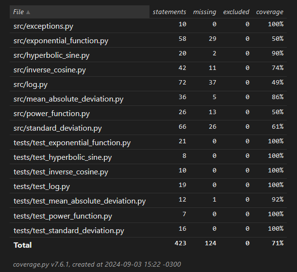
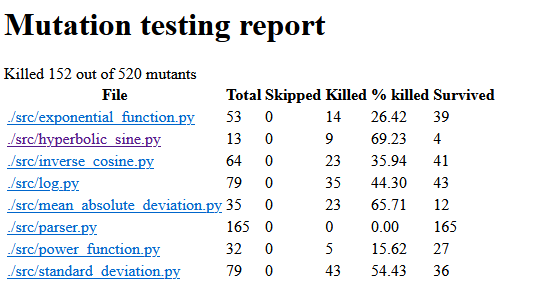
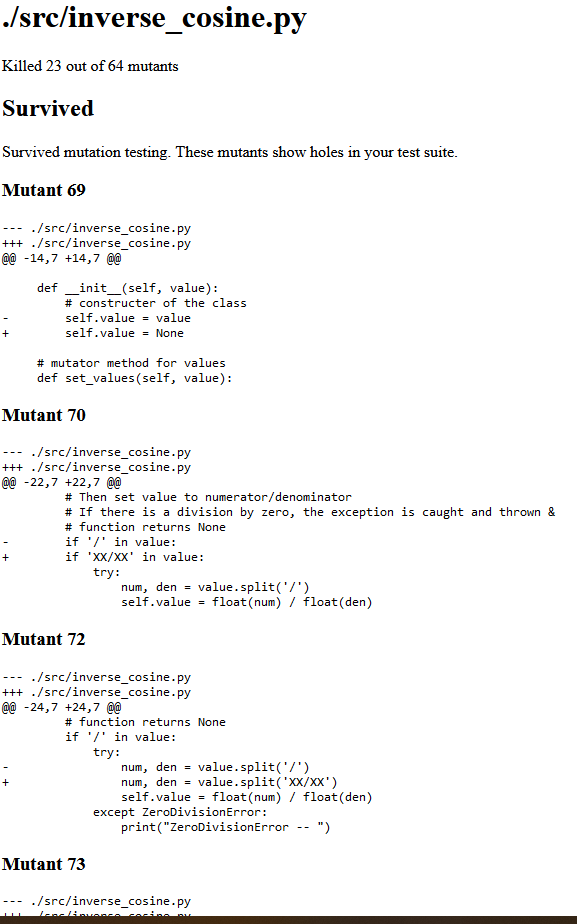
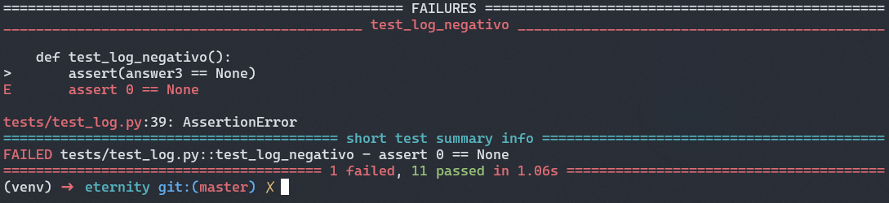
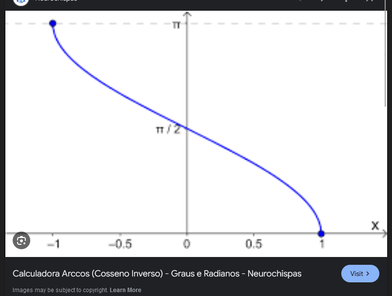
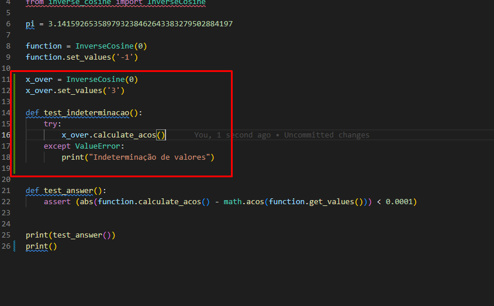
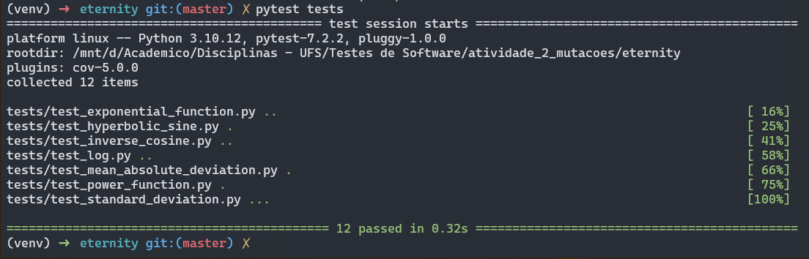

# Testes de Software - Eternity

Aluno: Marcos Gabriel da Silva Santos


## Documentação
Documentação da atividade: 

## Instalação

### 1. Instalação do ambiente
Com o python instalado realize a instalação da biblioteca do ambiente.

No Linux
```bash
  pip install virtualenv

  virtualenv -p python3 venv

  source venv/bin/activate

```

### 4. Instalação de Dependências
Dentro do ambiente instale as dependências

```
  pip install -r requirements.txt
```


### 3. Execução do Projeto
Agora basta executar o projeto

```
  cd ui

  flask run
```

Com o projeto rodando você pode acessar http://localhost:5000/ para acessar a calculadora ciêntífica do projeto base

## Testes

Para executar os testes siga esse passo a passo

### 1. Testes Unitários

```
  pytests tests
```

### 2. Cobertura de Testes
```
  pytests --cov tests
```

É esperado que apareça no terminal a seguinte tabela de cobertura.

```
---------- coverage: platform linux, python 3.10.12-final-0 ----------
Name                                    Stmts   Miss  Cover
-----------------------------------------------------------
tests/test_exponential_function.py         21      0   100%
tests/test_hyperbolic_sine.py               8      0   100%
tests/test_inverse_cosine.py               10      0   100%
tests/test_log.py                          19      0   100%
tests/test_mean_absolute_deviation.py      12      1    92%
tests/test_power_function.py                7      0   100%
tests/test_standard_deviation.py           16      0   100%
-----------------------------------------------------------
TOTAL                                      93      1    99%
```

### 3. Report de Cobertura
```
  pytest --cov --cov-report=html tests/ 
```

Acessando com um clinte web o arquivo `index.html` localizada na pasta html




### 4. Testes de Mutação

Para executar  o teste de mutação utilizando o `mutmut`, use o seguinte comando:

```
  mutmut run --paths-to-mutate=./src
```

é esperado que o comando retorne o seguinte:

```
  mutmut cache is out of date, clearing it...
  1. Running tests without mutations
  ⠦ Running...Done

  2. Checking mutants
  ⠼ 520/520  🎉 152  ⏰ 0  🤔 1  🙁 367  🔇 0
```

Para cada teste é possivel gerar o relatório das mutações realizadas. Utilize o comando:

```
  mutmut results
```

e 
```
  mutmut show
```

Que irá retornar os sobreviventes no seguinte formato:

```
  Survived 🙁 (367)

  ---- ./src/exponential_function.py (39) ----

  1-6, 8-13, 15, 17-22, 29, 32, 36-53

  ---- ./src/hyperbolic_sine.py (4) ----

  55-57, 66

  ---- ./src/inverse_cosine.py (41) ----

  69-70, 72-76, 78-80, 82, 84, 87-89, 92-97, 99-101, 103-107, 109-110, 112-120, 123

  ---- ./src/log.py (43) ----

  131-134, 139, 141, 146, 149-173, 181-182, 184, 190, 194-195, 201-203, 206-207

  ---- ./src/mean_absolute_deviation.py (12) ----

  212-216, 225, 230-231, 234-235, 237, 244

  ---- ./src/parser.py (165) ----

  245-409
```

### 5. Report de Testes de Mutação
Para gerar um comando em HTML do testes de mutação realizados utilze o comando

```
mutmut html
```

Esse comando irá gerar uma pasta `html` contendo o `index.html` da aplicação, abra utilizando seu navegador


dos 520 mutantes criados 152 foram eliminados.

Você consegue ver com mais detalhes no `index.html` de cada modulo. Como por exemplo do coseno inverso. (mais pra frente sera abordado um caso de teste adicional para ele)



## Novos Casos de Teste

### Log negativo
Para incluir novos testes podemos criar casos que não são abordados nos testes matemáticos do projeto, como por exemplo testar como o projeto se comporta com valores negativos.

“log de número negativo em qualquer base não existe ( Indeterminação )”


Ao incluir esse caso de teste podemos executá-lo com ‘pytest tests’



Perceba que o teste falhou, ou seja, o código não considerou a possibilidade de log negativo, retornando 0 em seu lugar.


### Dominio de coseno inverso

Vamos criar outro teste, dessa vez com o coseno inverso

O coseno tem inverso domínio de [-1, 1]



vamos codar o teste



e para executar o teste executamos o 'pytest tests'



Assim como o esperado, o teste passou , ou seja, a calculadora prevê uma excesão para quando o está fora do  dominio; 